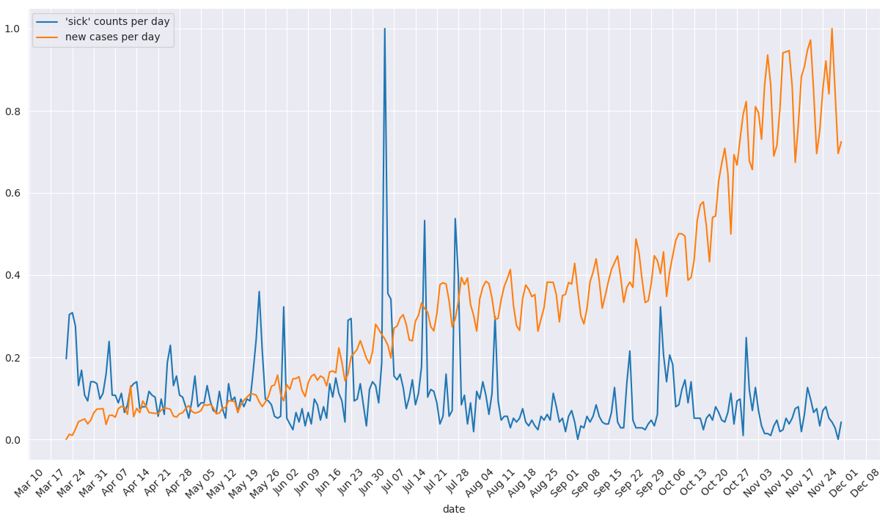
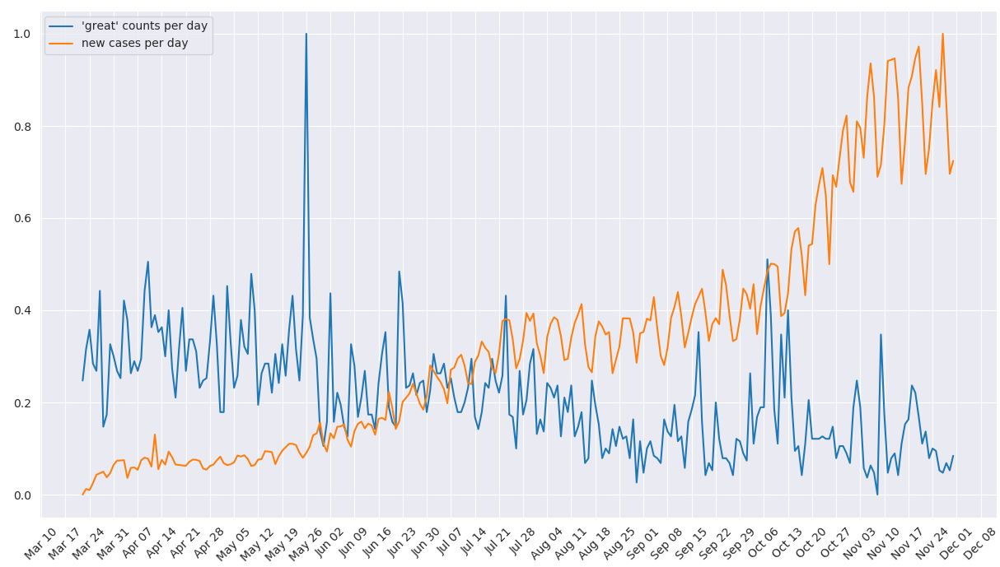

### Datasets

##### Data Collection

There are three datasets obtained for this project. First, we used the dataset which includes the daily Tweets IDs which can regenerate tweets about the covid-19 from March 22 to November 30 (inclusive) in the year 2020, collected by the <a href='https://github.com/thepanacealab/covid19_twitter' target='_blank'>Panacea Lab at Georgia State</a>. Then we sampled at a rate of one out of 360 tweet IDs per day for convenience purposes. On this subsampled dataset, we performed the Twitter collection process by using the Twitter API function “twarc” to rehydrate which requests the full tweet content based on the tweet IDs, and then got all the tweets about the covid-19. 

After obtaining all the tweets about covid-19 in the subsampled dataset, a training dataset that includes similar tweet contents with sentiment labels will be required in order to build the prediction models for sentiment analysis in the covid-19 tweets dataset. We then found a dataset from <a href='https://www.kaggle.com/kazanova/sentiment140' target='_blank'>Kaggle</a> that contains 1.6 million training data, and each row in the dataset contains the text of a tweet and a sentiment label, which the text variable can be extracted as the feature and sentiment label as the output result to make predictions to sentiment.

In order to observe and determine the significant correlation between the sentiment in the  covid-19 related social media posts and the numbers of disease daily cases, we obtained a  dataset which contains daily new positive cases and death cases all over the world, which is from <a href='https://github.com/owid/covid-19-data/tree/master/public/data' target='_blank'>Our World in Data</a>. 

##### Data Processing and Cleaning

In the tweets content dataset which is about covid-19, we extracted “tweet_id”, “text”, “location”, “retweeted_status”, “hashtag”, “follower_count”, “date”, and “language” from the raw dataset, and we also adjusted all columns to a suitable format and saved them as csv files. In addition, in order to have a cleaner version of the tweet text, we have converted all the text into lowercase and removed all the punctuations, stopwords, and usernames contained in the tweets. 

In the trained sentiment dataset, we only extracted “text” and “sentiment” from the original dataset, and we also made text lowercase, which can avoid standardizing the same words in different formats. Furthermore, we used “-1” to represent “negative” sentiment and “1” for “positive”, which is easier for us to calculate the total sentiment score during the 14-day period. In the daily cases dataset, we extracted cases and dates and removed all other unrelated columns. In addition, in the COVID-19 daily cases dataset, since it is relatively difficult to specify the region that the tweet users come from, we then summed up all the numbers of new cases around the world for 200 countries per day. 
 

|       | Number of Observations | Avg. Text Length  | Median Text Length | Avg. Follower Counts |
|-------|------------------------|-------------------|--------------------|----------------------|
| Stats | 1,007,496              | 87.639            | 85.0               | 19,146.348           |

*Table 1: Statistics of Tweet Contents Dataset*
 

|       | Number of Observations | Avg. Text Length  | Median Text Length | Counts of Pos. Sentiment |
|-------|------------------------|-------------------|--------------------|--------------------------|
| Stats | 1,600,000              | 74.090            | 69.0               | 800,000                  |

*Table 2: Statistics of Trained Sentiment Dataset*
 

|       | Number of Observations | Avg. Daily New Cases | Std. of Daily New Cases | Median of Daily New Cases |
|-------|------------------------|----------------------|-------------------------|---------------------------|
| Stats | 254                    | 496,645.024          | 322,896.980             | 457,871                   |

*Table 3: Statistics of Daily New Cases Dataset*
 

---

### Data Analysis

##### Text Analysis

After cleaning the text in the Twitter dataset, we have performed an exploratory data analysis on it. By calculating the term frequency and Tf-Idf throughout these Twitter posts, the tables of frequencies were acquired respectively. We noticed that these two vectorizers gave out similar results; for example, the three most frequent terms in both tables are “covid19”, “coronavirus”, and “trump”. In order to visually compare the results, a graph of the word cloud for both vectorizers was generated as shown in Figures 1 and 2 below.
 
 

{:.wcimg}

Figure 1: word cloud by using CountVectorizer

{:.wcimg}

Figure 2: word cloud by using TfIdfVectorizer

To compare the daily term frequencies and the counts of daily covid-19 cases, we tried to visualize the difference between trends by drawing the frequencies of specific terms by dates overlaid the plot of Covid-19 case numbers. After intuitively preselecting the words “great” and “sick” (two words that represent positive and negative sentiment), two graphs are generated by plotting the normalized counts of terms per day and daily case numbers from March 22 to November 30. As shown in Figures 3 and 4, we observed that there are no direct or obvious correlations between the trend of selected terms and the count of daily new cases. 
  

{:.plotimg}

Figure 3: plot of term frequencies (“sick”) overlaid by counts of new cases

{:.plotimg}

Figure 4: plot of term frequencies (“great”) overlaid by counts of new cases

---