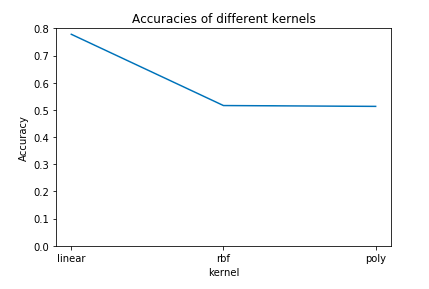
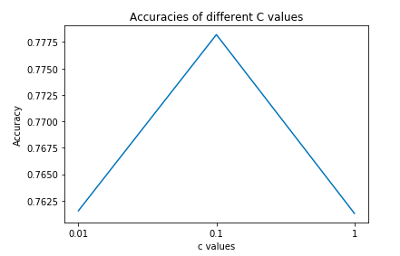
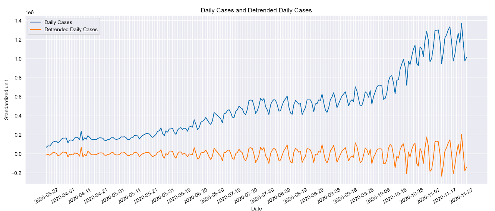
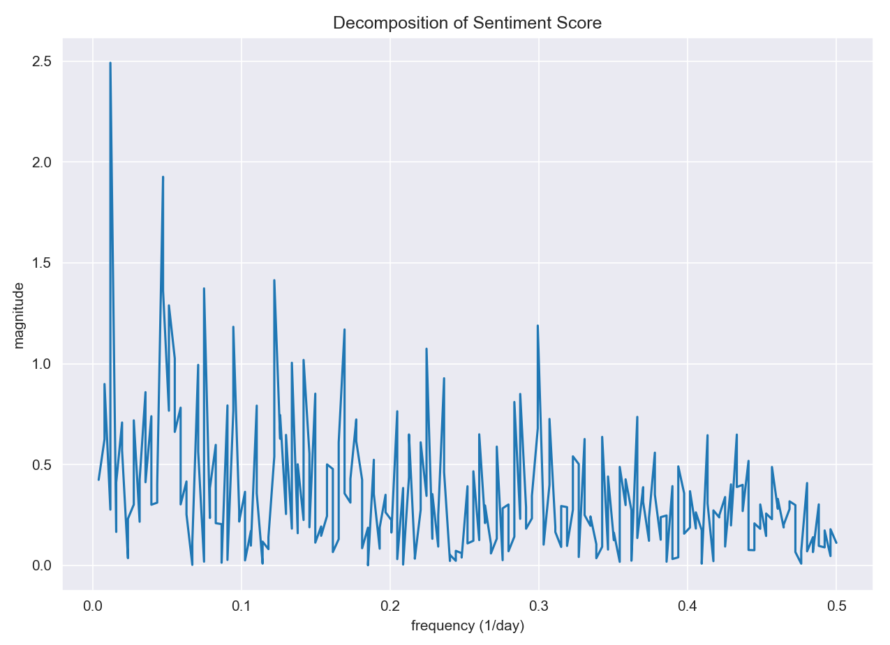

### Methodology and Results

##### Baseline Model: BERT Tokenizer & Logistic regression

Before building models, we need to tokenize all text data into smaller units, so we are going to use BERT tokenizer to convert the whole text into numerical arrays.[1] By importing the transformers package, we used the “tokenizer” function to convert the text to arrays of numbers and then pad different arrays to the max length and convert it to the parse matrix. Then, we decided to use the logistic regression model as our baseline model to predict the sentiment of the
text in the covid-19 tweets dataset, and we firstly got a base accuracy of 0.53, which is well-grounded.

##### Advanced Model: CountVectorizer and SVC

Although the accuracy of the baseline logistic regression model is acceptable, it is imprecise for us to predict sentiment for the covid 19 tweets dataset. Therefore, we decided to build the SVC model as the advanced model.We are going to use the sklearn function “countvectorizer” to convert text to a vector of tokens, which can help us to use the resulting matrix as input to put it into the model. Then, when we firstly trained an SVC model with default parameter values, we got an accuracy of 0.56, which hasn't reached our goal yet. Therefore, in order to improve the accuracy, we did some parameter tuning to the SVC model. First, we just loop through different kernels which are linear, polynomial and rbf, and finally from the figure 5,we can clearly find that the SVC model using linear hyperplane achieves over 75% accuracy, but SVC models using rbf and polynomial hyperplane’s accuracy are only near to 0.5. Second, we also loop through different c values (the penalty parameter of the error term) which are 0.01, 0.1 and 1, and from Figure 6, we can find that when the c value equals to 0.1, the model reaches the highest accuracy which is 0.7782. Therefore, we decide to choose the SVC model with linear hyperplane and the c value equals 0.1 as the final advanced model which we will use to predict the sentiment for the covid-19 tweets dataset. 

<table align='center' class='imgtable'>
    <tr>
        <td style="border:none;"></td>
        <td style="border:none;"></td>
    </tr>
</table>

Figure 5 (left): Accuracies of models using different kernels  Figure 6 (right): Accuracies of models with different c values

##### Analyzing Seasonality in Daily New Cases and Daily Tweet Sentiment

Our first step is to detrend the daily new case data. As we can see in the graph, daily cases data has upward mobility which is the result of multiple factors such as exponential transmitting rate and state policy. Our sentiment score does not have a trend in the long run. However, both of the data have a seasonality component which could be correlated. To detrend the data, we used the seasonal decompose module to locate the trends and use regression of order 3 to fit the shape of the curve. We then subtracted the composition from the original data to obtain a flat version of daily cases with only the seasonality.
 
{:.plotimg2}

Figure 7: Daily Cases with Detrended Daily Cases

By plotting the sentiment data with the detrended data we can see that they do have similar fluctuations in the previous three months, the crest and trough of the data roughly align with one another. Along the horizontal axis, we noticed that the two time series matches less and less. One possible reason for the irregularities in later periods is that our detrended cases daily did not take into account how the upward trend affect the magnitude of the fluctuations. With the increase in cases per day, the fluctuation number also increases. On the other hand, the magnitude of the seasonality in sentiment does not vary significantly.
 
{:.plotimg2}

Figure 8: Sentiment Score VS. Detrended Daily Cases

Due to the nature of time-series data, we are not exploring the causality of these two variables. Instead, we set our goals to determine the correlation of them to gain insight into how people's moods are represented by social media affected by the daily COVID cases. We first calculated the Pearson correlation of the two time series data and got a result of 0.073. This would suggest a weakly positive relationship in an independent context. In this case, both of our data are dependent on time which makes the interpretation intricate. We can only deduce that there is no strong linear relationship between Sentiment Score and Detrended Daily Cases. The cointegration test is a statistical technique that examines if two time series are integrated together at a specified degree. To perform this test, we first tested the stationarity of sentiment score and detrended cases using the Augmented Dickey-Fuller unit root test. Both of them produce a p-value of almost 0 which suggests that we should reject the null hypothesis that there is non-stationarity in the data. We accept the alternative hypothesis that our data is stationary. This effectively states that there is no cointegration between the two since both of them are stationary time series while cointegration only works on non-stationary data. 

In addition, we analyzed the seasonal frequency of the two time series. Fourier transformation decomposes a function of time into temporal frequencies. We performed the transformation and plotted the frequencies for two separate time series. Comparing the two plots, we found that Daily cases have a dominant frequency at around 0.14. Converting to days, 0.14 represents approximately 7 days which suggests daily cases mainly oscillate weekly. This is most likely related to the reporting method of daily cases. Sentiment score on the other hand does not have a dominant frequency. It has multiple spikes with similar magnitudes.

<table align='center' class='imgtable2'>
    <tr>
        <td style="border:none;"></td>
        <td style="border:none;"></td>
    </tr>
</table>

Figure 9 (left): Sentiment Score Decomposition Figure 10 (right): Daily Cases Decomposition

---

### Findings and Conclusions

Covid-19, as one of the biggest problems facing humans in this century, has affected all aspects of people’s lives, from the way how people interact, to people’s lifestyles, and even social media. In this project, by using the “covid-19 tweets” dataset obtained from the Panacea Lab, we predicted the total sentiment score of each day’s tweets from March 22 to November 30 (inclusive) and explored the correlation between sentiment scores and daily new cases of Covid-19. In order to predict the sentiment score of the Covid-19 tweets dataset, we found a pre-trained tweets dataset with labeled sentiment scores on the Kaggle website. After model evaluation and parameter tuning, we finally decided to use the SVC model(c = 0.1, kernel = ‘linear’) which has an accuracy of 0.7782 to predict the sentiment score of the Covid-19 tweets dataset. 

To compare the time series of daily sentiment scores and detrended daily cases, we plotted them on the same graph. Although we observe some initial correspondence between the two variables, in order to make sure they are statistically significant, we conducted multiple tests including Pearson Correlation, Augmented Dickey-Fuller unit root test, and Fourier transform. We used Pearson Correlation to get an approximate idea of the overall correspondence between sentiment and daily cases since the test is subject to the effect of noise in time series. A score of 0.073 suggests that there might be a weak positive relationship. After that, we looked into cointegration tests which check whether two time series are integrated in a way that does not change in the long run. The result suggests that there exists no cointegration relationship since both of our time series are statistically significant stationary. 

Since the previous two tests ruled out relationships between our variables. We studied features that differentiate them by using Fourier Transformation which decomposes temporal frequencies out of time series. By plotting the frequencies, we noticed that sentiment score has no dominant frequency while daily cases have one at 0.14 which corresponds to a period of roughly 7 days. This could explain why the first two tests do not find a strong relationship between them. If the frequency of the two does not coincide with each other, these two time series are constantly out of phase which results in low statistical significance in correlation. The weekly period of the daily cases is likely connected to the reporting mechanism. For example, some facilities may choose to report their weekly cases on Monday instead of reporting daily. While sentiment score is calculated on a continuous daily basis, the discrepancy resulted in different oscillating frequencies of the seasonality in daily cases and sentiment.

---